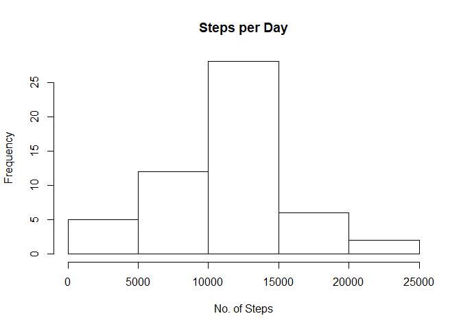
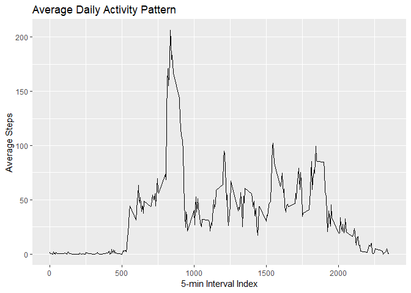
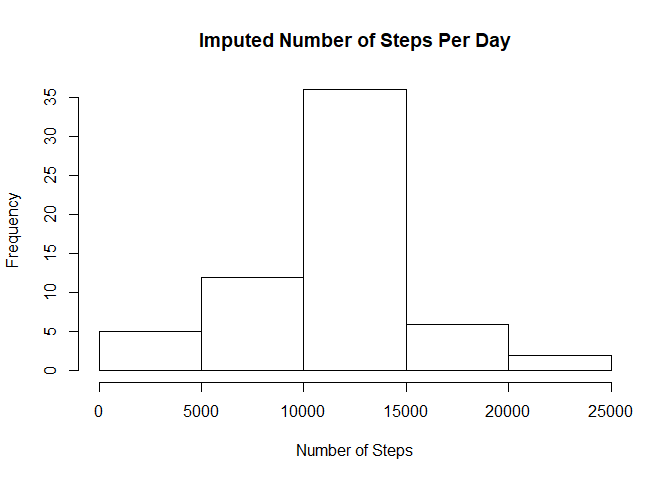
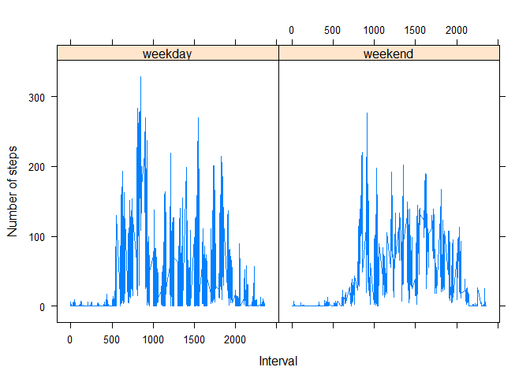

## Loading and preprocessing the data


```r
library(ggplot2)
# Unzipping the CSV data file if not present in the directory
if (!file.exists('activity.csv')) {
  unzip(zipfile = "activity.zip")
}

# Loading the unzipped CSV file
activityData <- read.csv(file="activity.csv", header=TRUE)

# Removing any row which have NA steps, because that might be not useful
activityData1 <- activityData[!is.na(activityData$steps), ]
```

## What is mean total number of steps taken per day?

```r
totalSteps <- aggregate(steps ~ date, activityData1, FUN=sum)

hist(totalSteps$steps, main = "Steps per Day", xlab = "No. of Steps")
```

<!-- -->

```r
meanSteps <- mean(totalSteps$steps)
medianSteps <- median(totalSteps$steps)

print(paste0("Mean number of steps taken per day is ", meanSteps))
```

```
## [1] "Mean number of steps taken per day is 10766.1886792453"
```

```r
print(paste0("Median number of steps taken per day is ", medianSteps))
```

```
## [1] "Median number of steps taken per day is 10765"
```


## What is the average daily activity pattern?

```r
meanSteps_interval <- aggregate(steps ~ interval, activityData1, mean)

ggplot(data = meanSteps_interval, aes(x = interval, y = steps)) +
  geom_line() +
  ggtitle("Average Daily Activity Pattern") +
  xlab("5-min Interval Index") +
  ylab("Average Steps") 
```

<!-- -->

```r
print(paste0("The 5-min interval which have maximum number of steps is ", meanSteps_interval$interval[which.max(meanSteps_interval$steps)]))
```

```
## [1] "The 5-min interval which have maximum number of steps is 835"
```


## Imputing missing values

```r
print(paste0("Total Number of missing values are  ", sum(is.na(activityData$steps))))
```

```
## [1] "Total Number of missing values are  2304"
```

```r
imp_activityData <- transform(activityData, steps = ifelse(is.na(activityData$steps), meanSteps_interval$steps[match(activityData$interval, meanSteps_interval$interval)], activityData$steps))

impStepsByInt <- aggregate(steps ~ date, imp_activityData, FUN=sum)
hist(impStepsByInt$steps,
     main = "Imputed Number of Steps Per Day",
     xlab = "Number of Steps")
```

<!-- -->

```r
impMeanSteps <- mean(impStepsByInt$steps)
impMedSteps <- median(impStepsByInt$steps)

print(paste0("Mean number of steps taken per day for transformed data is ", impMeanSteps))
```

```
## [1] "Mean number of steps taken per day for transformed data is 10766.1886792453"
```

```r
print(paste0("Median number of steps taken per day for transformed data is ", impMedSteps))
```

```
## [1] "Median number of steps taken per day for transformed data is 10766.1886792453"
```

```r
print(paste0("Mean difference number of steps taken per day for transformed data is ", impMeanSteps-meanSteps))
```

```
## [1] "Mean difference number of steps taken per day for transformed data is 0"
```

```r
print(paste0("Median difference number of steps taken per day for transformed data is ", impMedSteps-medianSteps))
```

```
## [1] "Median difference number of steps taken per day for transformed data is 1.1886792452824"
```


## Are there differences in activity patterns between weekdays and weekends?


```r
activityData1$date <- as.POSIXct(activityData1$date, format="%Y-%m-%d")
activityData_withWeekday <- data.frame(date=activityData1$date, 
                           weekday=tolower(weekdays(activityData1$date)), 
                           steps=activityData1$steps, 
                           interval=activityData1$interval)

activityData_withWeekday <- cbind(activityData_withWeekday, 
                      daytype=ifelse(activityData_withWeekday$weekday == "saturday" | 
                                     activityData_withWeekday$weekday == "sunday", "weekend", 
                                     "weekday"))

activityMeanWeek <- aggregate(activityData_withWeekday$steps, 
                       by=list(activityData_withWeekday$daytype, 
                               activityData_withWeekday$weekday, activityData_withWeekday$interval), mean)

names(activityMeanWeek) <- c("daytype", "weekday", "interval", "mean")

library(lattice)
xyplot(mean ~ interval | daytype, activityMeanWeek, type="l", lwd=1, xlab="Interval", ylab="Number of steps", layout=c(2,1))
```

<!-- -->
